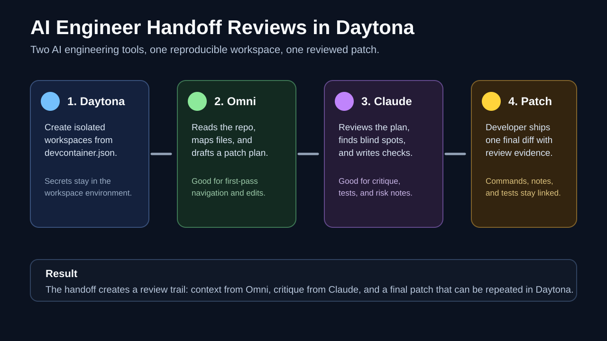

# Run AI Engineer Handoff Reviews in Daytona

## Introduction

AI coding tools are most useful when their work is easy to repeat, inspect, and hand off. A local terminal session can be fast, but it also tends to hide the details that matter later.

Those details include which dependencies were installed, which environment variables were available, and which repository state the assistant actually reviewed.

A [Daytona workspace](../definitions/20240819_definition_daytona%20workspace.md) gives the workflow a stable home so the setup is not recreated from memory.

This guide shows how to run a practical [AI engineer handoff](../definitions/20260530_definition_ai_engineer_handoff.md) using two open-source tools.

[Omni Engineer](https://github.com/Doriandarko/omni-engineer) handles first-pass repository exploration, and [Claude Engineer](https://github.com/Doriandarko/claude-engineer) handles a second-pass review.

The goal is not to let two assistants endlessly debate. The goal is to create one short loop: inspect, plan, challenge, and ship a patch with visible evidence.



## TL;DR

- Add a `devcontainer.json` to each AI engineer repository so Daytona can build the workspace in a predictable way.
- Pass API keys through Daytona or local environment variables, not through committed files.
- Use Omni Engineer to map files and propose a patch plan.
- Use Claude Engineer to challenge the plan and write a regression checklist.
- Keep the final human decision small: one reviewed diff, one validation log, one pull request.

## Companion Dev Container PRs

This workflow depends on two companion Dev Container contributions:

- Omni Engineer: [Doriandarko/omni-engineer#40](https://github.com/Doriandarko/omni-engineer/pull/40)
- Claude Engineer: [Doriandarko/claude-engineer#264](https://github.com/Doriandarko/claude-engineer/pull/264)

Both PRs use the official Python 3.11 Dev Container image and install repository dependencies during workspace creation. They also copy `.env.example` to `.env` only if a local `.env` is missing, which keeps setup convenient without overwriting a developer's secrets.

## Prerequisites

You need:

- Daytona installed and connected to your Git provider.
- A GitHub account that can create workspaces from repository URLs.
- An `OPENROUTER_API_KEY` for Omni Engineer.
- An `ANTHROPIC_API_KEY` for Claude Engineer.
- Optional `E2B_API_KEY` if you want Claude Engineer to use E2B-backed tooling.

Store the keys in your local shell, Daytona environment settings, or your workspace provider's secret store. Do not commit them to `.env`.

```bash
export OPENROUTER_API_KEY="..."
export ANTHROPIC_API_KEY="..."
export E2B_API_KEY="..."
```

## Step 1: Create the Omni Engineer Workspace

Create a Daytona workspace from the Omni Engineer repository after the Dev Container PR is available on your branch or fork:

```bash
daytona create https://github.com/Jorel97/omni-engineer --name omni-review
```

Open the workspace and confirm the Dev Container installed the dependencies:

```bash
python -m pip show openai rich prompt_toolkit
```

Then start Omni Engineer:

```bash
python main.py
```

Use Omni for first-pass exploration. Give it a tightly scoped task, not a vague request to improve a whole repository. For example:

```text
Inspect the issue report and identify the smallest files involved.
Do not edit yet. Return a patch plan with risks and tests.
```

The useful output from this phase is a short file map:

- files likely involved
- existing tests or missing tests
- assumptions that need checking
- one proposed patch path

## Step 2: Create the Claude Engineer Workspace

Create the Claude Engineer workspace:

```bash
daytona create https://github.com/Jorel97/claude-engineer --name claude-review
```

The companion Dev Container forwards port `5000`, so you can use the web UI or the CLI.

Run the web interface:

```bash
uv run app.py
```

Or use the CLI:

```bash
uv run ce3.py
```

Claude Engineer is the second reviewer in this workflow. Give it the plan from Omni and ask it to look for omissions:

```text
Review this patch plan. Identify hidden risks, missing tests, and cases where the proposed files might not be enough.
Return a short regression checklist and a final go/no-go recommendation.
```

This creates a useful separation of duties. The first AI assistant works like an explorer. The second works like a reviewer. The developer still decides what to ship.

## Step 3: Run a Concrete Handoff Review

Here is a small example you can repeat in any repository:

1. Pick one issue with a clear acceptance criterion.
2. Ask Omni Engineer to inspect the repository and return a patch plan.
3. Copy the plan into Claude Engineer.
4. Ask Claude Engineer to produce a risk list and validation checklist.
5. Apply only the patch that survives both passes.
6. Run the checks from the checklist.
7. Save the commands and results in the pull request body.

The handoff notes can be as simple as this:

```md
Omni Engineer found:
- API route: src/app/api/items/route.ts
- UI caller: src/components/ItemForm.tsx
- Existing test: tests/item-form.test.tsx

Claude Engineer challenged:
- Empty string is not covered.
- Server and client validation can drift.
- Add one test for whitespace-only names.

Final validation:
- npm test -- item-form.test.tsx
- npm run lint
```

The point is not to paste transcripts into the PR. The point is to preserve the decision trail that matters to reviewers.

## Step 4: Keep Secrets and State Clean

Both Dev Containers pass keys through `remoteEnv`:

```json
{
  "remoteEnv": {
    "OPENROUTER_API_KEY": "${localEnv:OPENROUTER_API_KEY}"
  }
}
```

That pattern avoids committing keys while still making them available inside the Daytona workspace. If you prefer to use `.env`, keep it local and rely on `.gitignore`. The companion PRs copy `.env.example` to `.env` only as a starter file.

For a clean handoff, keep these artifacts out of Git unless they are intentionally part of the change:

- `.env`
- generated chat logs
- screenshots with secrets
- temporary patch files
- dependency caches

## Step 5: Turn the Handoff Into a Pull Request

When the final patch is ready, write the PR body for humans first. A concise structure works well:

```md
## Summary
- Fixed whitespace-only item names in the item creation flow.
- Kept server and client validation consistent.
- Added a regression test.

## Review Notes
- Omni Engineer identified the route and form as the only affected surfaces.
- Claude Engineer flagged empty string and whitespace-only names as separate cases.

## Validation
- npm test -- item-form.test.tsx
- npm run lint
```

This gives maintainers enough context without asking them to trust the AI tools. They can inspect the final diff, then use the notes to understand why the diff is shaped that way.

## Troubleshooting

If the Omni workspace starts but cannot call a model, check `OPENROUTER_API_KEY` inside the workspace:

```bash
printenv OPENROUTER_API_KEY
```

If Claude Engineer starts but the web UI is not reachable, check that Daytona forwarded port `5000` and that the process is running:

```bash
uv run app.py
```

If dependency installation fails, rebuild the workspace from the Dev Container. The repository state should stay the same, but the container setup will run again from `devcontainer.json`.

## Conclusion

Daytona makes AI-assisted engineering easier to review because the environment is part of the workflow. Omni Engineer can gather context and propose a narrow patch. Claude Engineer can challenge that plan and turn it into a checklist.

The developer keeps the final decision, while the workspace keeps the setup reproducible.

That combination is the practical benefit of an AI engineer handoff: faster exploration without losing the discipline of review.

## References

- [Omni Engineer](https://github.com/Doriandarko/omni-engineer)
- [Claude Engineer](https://github.com/Doriandarko/claude-engineer)
- [Omni Engineer Dev Container PR](https://github.com/Doriandarko/omni-engineer/pull/40)
- [Claude Engineer Dev Container PR](https://github.com/Doriandarko/claude-engineer/pull/264)
- [Daytona Dev Container guide](../guides/20240820_guide_devcontainer_feature.md)
